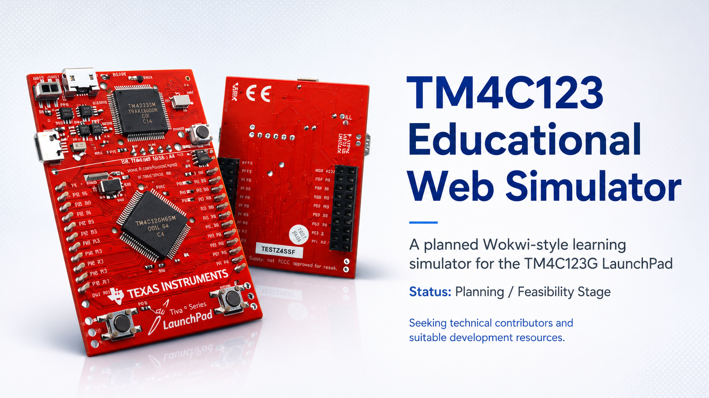

<div align="center">

# TM4C123 Educational Web Simulator



<br>

[](PROJECT_STATUS.md)
[](PROJECT_STATUS.md)
[](docs/TM4C123_Simulator_MVP_Specification_v0.1.md)
[](CONTRIBUTING.md)

### A planned browser-based learning simulator for the TM4C123G LaunchPad

Write normal TM4C123 C firmware, compile it for ARM Cortex-M4, execute it through a simulation engine, and observe register-level behavior through interactive virtual hardware.

**Current status:** Planning and feasibility stage — no usable simulator release is available yet.

[Project Status](PROJECT_STATUS.md) ·
[Roadmap](ROADMAP.md) ·
[Help Wanted](HELP_WANTED.md) ·
[Contributing](CONTRIBUTING.md) ·
[Support](SUPPORT.md)

</div>

---

## Table of Contents

- [Overview](#overview)
- [Current Project Status](#current-project-status)
- [Project Vision](#project-vision)
- [Target Execution Flow](#target-execution-flow)
- [Planned MVP Components](#planned-mvp-components)
- [Planned Firmware Support](#planned-firmware-support)
- [First Technical Milestone](#first-technical-milestone)
- [Architecture Direction](#architecture-direction)
- [Why Development Is Paused](#why-development-is-paused)
- [Repository Documentation](#repository-documentation)
- [Help Wanted](#help-wanted)
- [Contributing](#contributing)
- [Project Principles](#project-principles)
- [Status Summary](#status-summary)
- [Disclaimer](#disclaimer)

---

## Overview

The **TM4C123 Educational Web Simulator** is a planned browser-based simulator for the **TM4C123G LaunchPad**, inspired by the interactive workflow of tools such as Wokwi.

The project is intended primarily for students learning:

- Embedded C
- ARM Cortex-M4 fundamentals
- Memory-mapped I/O
- GPIO configuration
- Interrupt handling
- SysTick
- General-purpose timers
- Analog-to-digital conversion
- LCD interfacing
- Register-level microcontroller programming

The goal is not to imitate hardware behavior only through frontend animations.

A visible result must originate from:

```text
Real compiled firmware
→ CPU execution
→ register operations
→ peripheral behavior
→ pin-state changes
→ browser visualization
```

The project is intentionally limited to selected university laboratory examples rather than complete TM4C123 or complete Wokwi compatibility.

---

## Current Project Status

> [!IMPORTANT]
> This repository does not currently contain a finished or usable simulator.

The project is presently in the:

```text
Architecture
Planning
Compatibility analysis
Infrastructure planning
Feasibility validation
```

stage.

The repository currently contains detailed technical documentation, task definitions, architecture decisions, compatibility requirements, and feasibility plans.

Implementation code will be added only after the first end-to-end execution path is proven.

See the full status report in [`PROJECT_STATUS.md`](PROJECT_STATUS.md).

---

## Project Vision

The long-term student workflow is planned to look like this:

1. Open the simulator in a browser.
2. Write normal TM4C123 C code.
3. Compile the program for ARM Cortex-M4.
4. Generate an ELF firmware file.
5. Start a simulated TM4C123 session.
6. Execute the compiled firmware.
7. Interact with virtual buttons and components.
8. Observe LEDs, LCD output, ADC values, interrupts, timers, and digital signals.
9. Inspect errors and unsupported register behavior clearly.

The simulator should eventually allow students to connect and use:

- The TM4C123G LaunchPad
- External LEDs
- Pushbuttons
- Resistors
- An LCD1602
- A potentiometer
- A logic analyzer

---

## Target Execution Flow

```text
┌──────────────────────┐
│     User C Source    │
└──────────┬───────────┘
           │
           ▼
┌──────────────────────┐
│ ARM Cortex-M4 Build  │
│ arm-none-eabi-gcc    │
└──────────┬───────────┘
           │
           ▼
┌──────────────────────┐
│     ELF Firmware     │
└──────────┬───────────┘
           │
           ▼
┌──────────────────────┐
│   Execution Engine   │
│ Cortex-M4 + Time     │
└──────────┬───────────┘
           │
           ▼
┌──────────────────────┐
│ TM4C123 MMIO Models  │
│ GPIO / Timers / ADC  │
└──────────┬───────────┘
           │
           ▼
┌──────────────────────┐
│ Pins and Components  │
└──────────┬───────────┘
           │
           ▼
┌──────────────────────┐
│ Browser Visualization│
└──────────────────────┘
```

The frontend must not manufacture LED, LCD, button, ADC, or timer behavior independently of firmware execution.

---

## Planned MVP Components

| Component | Planned purpose |
|---|---|
| TM4C123G LaunchPad | Main simulated development board |
| Built-in RGB LED | PF1, PF2, and PF3 output examples |
| SW1 | PF4 active-low button input |
| SW2 | PF0 active-low button input |
| External LED | Basic GPIO output and wiring |
| Pushbutton | External digital input |
| Resistor | Basic educational circuit wiring |
| Potentiometer | Analog voltage input |
| LCD1602 | Character-display laboratory examples |
| Logic analyzer | Digital waveform observation |

---

## Planned Firmware Support

The MVP is intended to support selected educational examples involving:

### GPIO

- Digital input and output
- Port clock enable
- Direction configuration
- Digital enable
- Pull-up configuration
- Built-in RGB LED control
- SW1 and SW2 polling

### Protected PF0 Configuration

- GPIO lock register
- Commit control
- PF0 unlock sequence
- SW2 input configuration

### Interrupts

- GPIO edge interrupts
- Interrupt masking
- Interrupt status
- Interrupt clearing
- NVIC interrupt enable
- Interrupt service routines

### SysTick

- Reload configuration
- Current-value reset
- Periodic interrupt generation
- Counter and LED-toggle examples

### General-Purpose Timers

Planned initial timer coverage includes:

```text
TIMER0A
TIMER1A
TIMER2A
```

### LCD1602

- HD44780-compatible behavior
- 4-bit communication mode
- Commands and character data
- Planned Port B laboratory examples

### ADC

- ADC0
- Sample Sequencer 3
- PE3 / AIN0
- Polling examples
- Interrupt examples
- Potentiometer-based analog input

### Logic Analyzer

- Digital state transitions
- Virtual timestamps
- HIGH and LOW waveforms
- Deterministic signal capture

---

## First Technical Milestone

Before building a large UI, the project must prove this complete vertical slice:

```text
C source
→ Cortex-M4 ELF
→ execution engine
→ SYSCTL clock configuration
→ GPIOF register writes
→ effective PF1 output
→ red LED state in the browser
```

This milestone must demonstrate that:

- Real C source is compiled.
- Real Cortex-M4 instructions are executed.
- TM4C123 memory-mapped registers are modeled.
- GPIO state is calculated from register behavior.
- The browser receives the resulting output event.
- The LED is not controlled through hardcoded frontend behavior.

No large component editor or complete visual workspace should be implemented before this path is validated.

---

## Architecture Direction

The current architecture direction includes the following candidates:

| Layer | Current direction |
|---|---|
| Frontend | React and TypeScript |
| Backend orchestration | Node.js and TypeScript |
| Firmware compiler | ARM GNU Embedded Toolchain |
| Firmware artifact | ELF |
| Initial execution-engine candidate | Renode |
| TM4C123 peripheral models | Custom register-level models |
| Renode peripheral language | C# |
| Communication | Structured runtime events |
| Project wiring format | Wokwi-inspired `diagram.json` |
| Execution model | Isolated server-side workers |
| Timing model | Deterministic virtual time |

Some of these choices remain conditional on the successful completion of the feasibility spike.

Read the architecture documentation:

- [`Architecture Design`](docs/PM-003_TM4C123_Architecture_Design_v0.1.md)
- [`Decision Log`](docs/DECISION_LOG.md)
- [`Repository Structure`](docs/REPOSITORY_STRUCTURE.md)
- [`Feasibility Spike Plan`](docs/RISK-001_TM4C123_Feasibility_Spike_Plan_v0.1.md)

---

## Why Development Is Paused

The next implementation phase requires a suitable environment for:

- Docker-based isolation
- ARM Cortex-M4 cross-compilation
- `arm-none-eabi-gcc`
- ELF inspection and loading
- Renode or another suitable execution engine
- Custom TM4C123 peripheral development
- Automated integration testing
- CI runners
- Adequate storage and memory
- Safe execution of untrusted user code

The currently checked environment does not yet provide all required tools and resources.

Development is therefore temporarily paused while a more suitable development environment and additional technical support are arranged.

This pause does not mean the project has been abandoned.

See:

- [`Infrastructure Requirements`](docs/INFRASTRUCTURE_REQUIREMENTS.md)
- [`Help Wanted`](HELP_WANTED.md)
- [`Project Status`](PROJECT_STATUS.md)

---

## Repository Documentation

### Core Planning Documents

| Document | Purpose |
|---|---|
| [`MVP Specification`](docs/TM4C123_Simulator_MVP_Specification_v0.1.md) | Defines the initial product scope |
| [`Compatibility Matrix`](docs/PM-002_TM4C123_Compatibility_Matrix_v0.1.md) | Maps laboratory examples to required support |
| [`Architecture Design`](docs/PM-003_TM4C123_Architecture_Design_v0.1.md) | Describes the proposed technical architecture |
| [`Feasibility Spike Plan`](docs/RISK-001_TM4C123_Feasibility_Spike_Plan_v0.1.md) | Defines the first technical proof |
| [`Decision Log`](docs/DECISION_LOG.md) | Records important architecture decisions |
| [`Glossary`](docs/GLOSSARY.md) | Explains project terminology |
| [`Infrastructure Requirements`](docs/INFRASTRUCTURE_REQUIREMENTS.md) | Documents required development resources |
| [`Repository Structure`](docs/REPOSITORY_STRUCTURE.md) | Explains current and proposed repository layout |

### Project and Community Documents

| Document | Purpose |
|---|---|
| [`Project Status`](PROJECT_STATUS.md) | Current project condition |
| [`Roadmap`](ROADMAP.md) | Planned project stages |
| [`Help Wanted`](HELP_WANTED.md) | Areas where technical help is needed |
| [`Contributing`](CONTRIBUTING.md) | Contribution workflow and requirements |
| [`Support`](SUPPORT.md) | How to request technical help |
| [`Security`](SECURITY.md) | Security reporting and execution risks |
| [`Code of Conduct`](CODE_OF_CONDUCT.md) | Collaboration standards |

---

## Help Wanted

Technical contributors are welcome.

The project would benefit most from expertise in:

- ARM Cortex-M4 architecture
- TM4C123 register-level programming
- Bare-metal startup and linker scripts
- Renode platform development
- C# peripheral modeling
- ELF loading and inspection
- Docker sandboxing
- Secure execution of untrusted code
- React and TypeScript
- Node.js orchestration
- WebSocket or event-stream design
- Digital pin and circuit-state modeling
- Automated testing
- CI/CD
- Development infrastructure
- Technical architecture review

Contributors do not need to implement the complete simulator.

The project workflow is intentionally divided into small, bounded, independently testable tasks.

See [`HELP_WANTED.md`](HELP_WANTED.md) for current needs.

---

## Contributing

Before contributing:

1. Read [`CONTRIBUTING.md`](CONTRIBUTING.md).
2. Review [`PROJECT_STATUS.md`](PROJECT_STATUS.md).
3. Read the relevant documents inside `docs/`.
4. Select one small task with a defined scope.
5. Open an Issue before starting architecture-changing work.
6. Avoid broad or unrelated refactoring.
7. Include exact commands and test results.
8. Document unsupported behavior and known limitations.
9. Do not claim that unimplemented functionality works.
10. Keep changes consistent with approved architecture decisions.

Useful Issue templates include:

- Contribution offer
- Technical help request
- Architecture question
- Bug report

---

## Project Principles

The project follows these principles:

- **Correctness before visual polish**
- **Real firmware execution**
- **Register-level hardware behavior**
- **Small and reviewable tasks**
- **Deterministic virtual time**
- **No hidden frontend hardware logic**
- **No silent unsupported behavior**
- **Clear acceptance criteria**
- **Reproducible tests**
- **Secure execution isolation**
- **Honest project status**

---

## Status Summary

| Area | Status |
|---|---|
| Product scope | Documented |
| MVP requirements | Documented |
| Laboratory examples | Documented |
| Compatibility matrix | Documented |
| Architecture design | Documented |
| Feasibility-spike plan | Documented |
| Task workflow | Documented |
| Infrastructure requirements | Documented |
| Development environment | Not yet provisioned |
| Compiler integration | Not implemented |
| ELF loading | Not implemented |
| Cortex-M4 execution | Not implemented |
| TM4C123 peripheral models | Not implemented |
| Browser simulator UI | Not implemented |
| Public hosted simulator | Not available |
| Stable release | Not available |

---

## Disclaimer

This is an independent educational project.

It is not affiliated with, sponsored by, or endorsed by:

- Texas Instruments
- Wokwi
- Renode
- Any university

Product names, company names, board names, and trademarks belong to their respective owners.

The project banner is used for educational project presentation. Any third-party product imagery or marks remain the property of their respective owners.

---

<div align="center">

### TM4C123 Educational Web Simulator

**Architecture first. Real firmware execution. Honest simulation.**

[Back to top](#tm4c123-educational-web-simulator)

</div>
