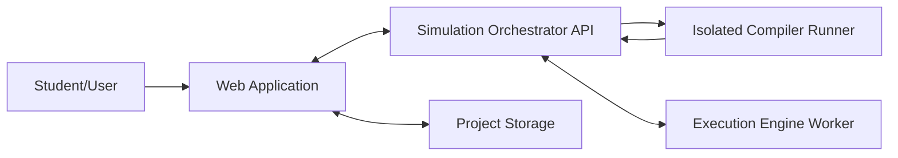
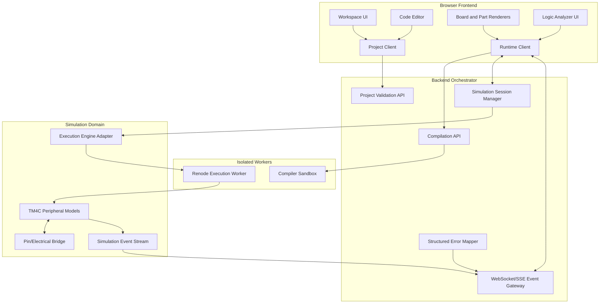
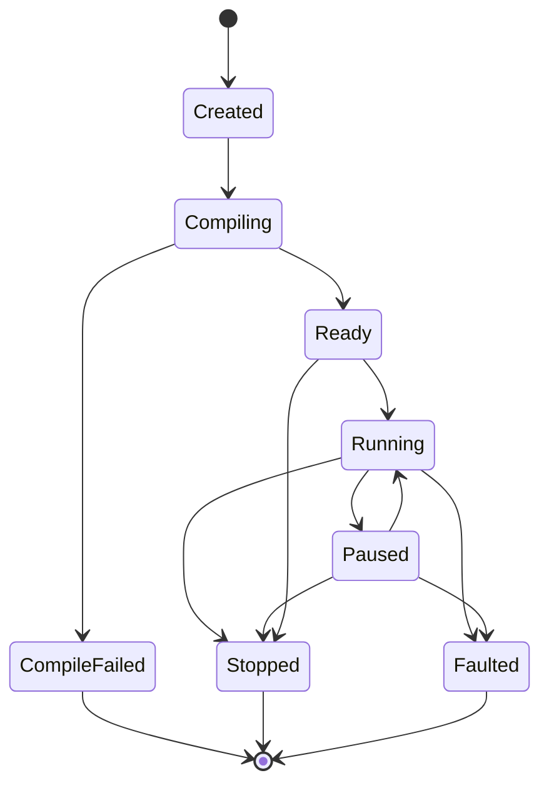
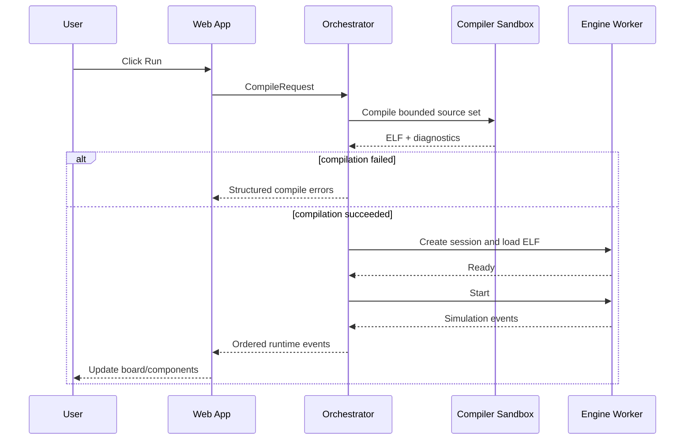
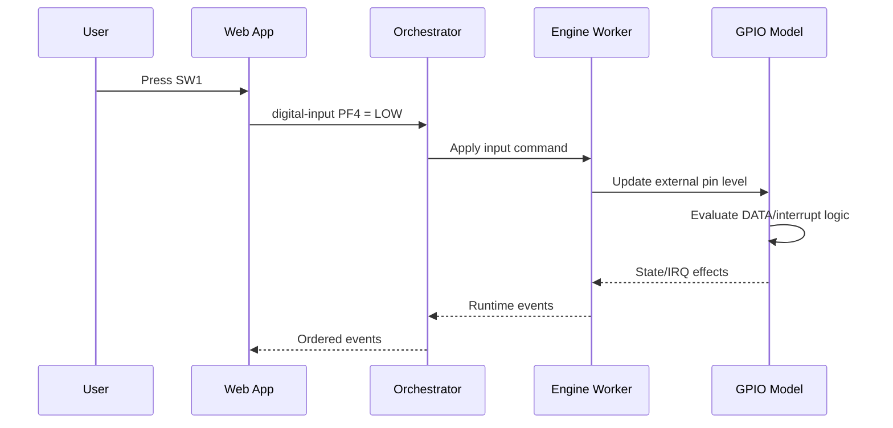
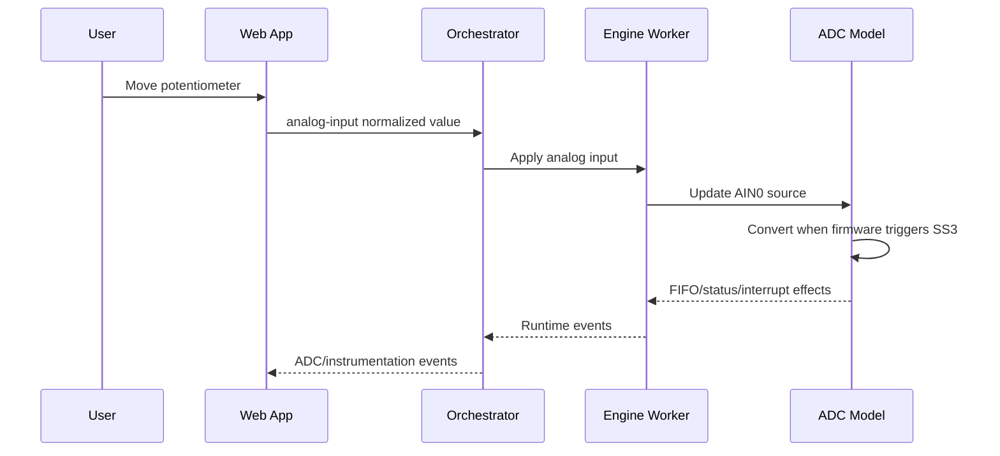

# TM4C123 Simulator — PM-003 Architecture Design

**Document ID:** PM-003  
**Version:** 0.1  
**Status:** Draft for approval  
**Parent documents:**

- `TM4C123 Simulator MVP Specification v0.1`
- `PM-002 TM4C123 Compatibility Matrix v0.1`

---

## 1. Purpose

This document defines the technical architecture of the TM4C123 Educational Web Simulator.

It establishes:

- System boundaries.
- Module responsibilities.
- Data flow between browser, compiler, execution engine, and simulated hardware.
- Stable interfaces between modules.
- Security and isolation boundaries.
- Repository structure.
- Testing strategy.
- Architecture gates that must pass before feature implementation expands.

This document does not implement the simulator. It defines the structure that all implementation tasks must follow.

---

## 2. Architectural Goals

The architecture must support the following complete path:

```text
User C source
→ isolated Cortex-M4 compilation
→ ELF firmware
→ Cortex-M4 execution
→ TM4C123 MMIO/register behavior
→ electrical pin state
→ board/component visualization
```

The system must also support the reverse input path:

```text
User presses button or moves potentiometer
→ component input event
→ electrical net update
→ TM4C GPIO/ADC input
→ running firmware observes the change
```

### Primary quality goals

1. **Correctness before visual polish.**
2. **Small independently testable modules.**
3. **No UI-generated fake MCU output.**
4. **Deterministic simulation behavior.**
5. **Clear failure for unsupported functionality.**
6. **Replaceable execution-engine integration.**
7. **Safe execution of untrusted user code.**
8. **Incremental delivery through vertical slices.**

---

## 3. Architecture Principles

### 3.1 Single source of truth

The simulated MCU/peripheral state is the authoritative source for:

- GPIO output levels.
- Interrupt state.
- Timer state.
- ADC conversion state.
- LCD bus activity.
- Logic-analyzer events.

The frontend may render state but must not invent it.

### 3.2 Inputs and outputs are different

A physical user action may enter the simulation:

```text
Button press
Potentiometer movement
Reset press
```

A visual hardware output must leave the simulation:

```text
LED state
LCD text
Logic-analyzer transition
Pin state
```

The browser may originate physical inputs, but MCU outputs must originate from executed firmware and modeled hardware.

### 3.3 Engine isolation

The frontend and project model must not depend directly on Renode-specific APIs.

All execution-engine communication passes through an `ExecutionEngineAdapter`.

This allows:

- Renode as the initial implementation.
- A future alternative engine without rewriting the workspace.
- Mock engines for tests.

### 3.4 Peripheral isolation

Every TM4C peripheral owns its:

- Register offsets.
- Reset values.
- Read/write semantics.
- Interrupt behavior.
- Observable outputs.

A GPIO task must not modify ADC or timer internals.

### 3.5 No silent compatibility

An unsupported register access, malformed project, unavailable pin, invalid connection, compile error, or runtime fault must produce a structured error.

---

# 4. System Context



### External actors

| Actor | Responsibility |
|---|---|
| Student/User | Creates circuit, writes code, runs simulation, interacts with parts |
| Browser | Workspace, code editor, controls, visualization |
| Compiler runner | Converts source files into Cortex-M4 ELF |
| Execution worker | Executes ELF and models TM4C123 behavior |
| Project storage | Saves source files and `diagram.json` |

Project storage may initially be browser-local. Server-side accounts and collaboration are outside the MVP.

---

# 5. High-Level Container Architecture



---

# 6. Main Deployable Units

## 6.1 Web application

**Recommended technology:** React + TypeScript.

Responsibilities:

- Workspace rendering.
- Board and part placement.
- Wire editing.
- Code editing.
- Project-file management.
- Run/pause/reset/stop controls.
- Runtime-event rendering.
- Compile/runtime error display.
- Logic-analyzer waveform display.

The web application must not:

- Compile through a user-controlled shell.
- Execute ARM instructions itself in the initial MVP.
- Modify peripheral registers directly.
- Turn LEDs on because a UI button was clicked.
- Parse Renode logs as its primary API.

---

## 6.2 Backend orchestrator

**Recommended technology:** Node.js + TypeScript.

Responsibilities:

- Validate incoming project/source requests.
- Create and manage simulation sessions.
- Invoke the compiler sandbox.
- Invoke the execution worker through an adapter.
- Forward input events to the correct session.
- Forward structured simulation events to the browser.
- Enforce request and session limits.
- Normalize compiler and runtime errors.
- Guarantee cleanup after session termination.

The orchestrator must not contain TM4C register logic.

---

## 6.3 Compiler sandbox

Responsibilities:

- Receive a bounded set of source files.
- Add approved startup/linker support where required.
- Invoke a pinned ARM GCC toolchain.
- Produce ELF, map file, and diagnostics.
- Return artifacts and structured errors.
- Run without outbound network access.
- Terminate on time/resource limits.
- Delete temporary files after every request.

Inputs:

```text
Source files
Approved compiler profile
Build identifier
```

Outputs:

```text
ELF firmware
Linker map
Compiler stdout/stderr
Structured diagnostics
Build metadata
```

User requests must never supply arbitrary command-line flags.

---

## 6.4 Execution-engine worker

The initial implementation is expected to use Renode, subject to `RISK-001` approval.

Responsibilities:

- Create one isolated simulation instance.
- Load the approved TM4C123 platform.
- Load an ELF artifact.
- Start, pause, resume, reset, and stop execution.
- Apply external input changes.
- Emit state-change events with virtual timestamps.
- Enforce execution limits.
- Terminate and clean up safely.

The execution worker must be replaceable through the engine adapter.

---

## 6.5 TM4C123 peripheral package

The peripheral package contains TM4C-specific behavior.

Initial modules:

```text
System Control
GPIO ports
GPIO interrupt logic
SysTick/NVIC integration
GPTM timers
ADC0 SS3
Board-level built-ins
```

Recommended implementation for Renode-specific peripherals:

```text
C# peripheral models
```

Generic browser/project code must not import these implementation classes directly.

---

# 7. Logical Layers

## 7.1 Presentation layer

Modules:

- Workspace.
- Toolbar.
- Parts panel.
- Code editor.
- Console.
- Logic analyzer.
- Board and component renderers.

Receives view models and runtime events.

---

## 7.2 Project layer

Modules:

- `diagram.json` parser.
- Schema validator.
- Part registry.
- Project source-file model.
- Project serialization.
- Migration/version handling.

This layer knows project definitions, not live MCU internals.

---

## 7.3 Electrical layer

Modules:

- Pin registry.
- Digital nets.
- Analog net abstraction.
- External pull-up/pull-down resolution.
- Component contact behavior.
- Input/output direction validation.

The MVP electrical layer is logical, not SPICE-based.

It must support:

- Digital HIGH/LOW.
- Floating/unknown detection.
- Logical pull-up/pull-down.
- Potentiometer analog level.
- Pin transitions with virtual timestamps.

---

## 7.4 Execution layer

Modules:

- Compile client.
- ELF artifact model.
- Execution-engine adapter.
- Simulation lifecycle.
- Runtime event translation.
- Input-command translation.

---

## 7.5 TM4C123 layer

Modules:

- Memory map.
- Register definitions.
- Peripheral models.
- Interrupt wiring.
- Board pin mapping.
- Reset defaults.

Each peripheral must expose behavior through defined ports/events rather than UI-specific calls.

---

## 7.6 Instrumentation layer

Modules:

- Event recording.
- Digital-transition subscriptions.
- Virtual timestamps.
- Logic-analyzer channel state.
- Runtime warnings.
- Optional register trace for development.

Instrumentation must observe the simulation without changing its behavior.

---

# 8. Core Domain Contracts

The following interfaces are architecture contracts. Exact syntax may change, but responsibilities must remain separated.

## 8.1 Project model

```ts
interface SimulatorProject {
  formatVersion: number;
  metadata: ProjectMetadata;
  diagram: DiagramDefinition;
  sources: SourceFile[];
}

interface SourceFile {
  path: string;
  language: "c" | "header" | "assembly" | "linker";
  content: string;
}

interface DiagramDefinition {
  version: number;
  parts: PartDefinition[];
  connections: ConnectionDefinition[];
}
```

---

## 8.2 Part model

```ts
interface PartDefinition {
  id: string;
  type: string;
  left: number;
  top: number;
  rotate?: number;
  hide?: boolean;
  attrs?: Record<string, unknown>;
}

interface PartDescriptor {
  type: string;
  displayName: string;
  pins: PinDescriptor[];
  validateAttrs(attrs: unknown): ValidationResult;
}
```

Parts are resolved through a registry:

```ts
interface PartRegistry {
  register(descriptor: PartDescriptor): void;
  get(type: string): PartDescriptor | undefined;
}
```

---

## 8.3 Connection model

```ts
interface ConnectionDefinition {
  from: PinReference;
  to: PinReference;
  color?: string;
  route?: WireRouteInstruction[];
}

interface PinReference {
  partId: string;
  pinId: string;
}
```

Validation must reject:

- Unknown parts.
- Unknown pins.
- Duplicate IDs.
- Invalid route instructions.
- Connections that violate mandatory pin constraints.

---

## 8.4 Compilation contract

```ts
interface CompileRequest {
  projectId?: string;
  files: SourceFile[];
  profile: "tm4c123-mvp";
}

interface CompileResult {
  buildId: string;
  success: boolean;
  elfArtifact?: ArtifactReference;
  mapArtifact?: ArtifactReference;
  diagnostics: CompileDiagnostic[];
  toolchain: ToolchainIdentity;
}
```

`ToolchainIdentity` must record the pinned compiler identity used for reproducibility.

---

## 8.5 Execution-engine adapter

```ts
interface ExecutionEngineAdapter {
  createSession(config: EngineSessionConfig): Promise<EngineSession>;
}

interface EngineSession {
  loadFirmware(artifact: ArtifactReference): Promise<void>;
  start(): Promise<void>;
  pause(): Promise<void>;
  resume(): Promise<void>;
  reset(): Promise<void>;
  stop(): Promise<void>;
  sendInput(command: SimulationInputCommand): Promise<void>;
  events(): AsyncIterable<SimulationEvent>;
  dispose(): Promise<void>;
}
```

No frontend code may call Renode directly.

---

## 8.6 Simulation inputs

```ts
type SimulationInputCommand =
  | {
      type: "digital-input";
      target: PinReference;
      level: 0 | 1;
      interactionId: string;
    }
  | {
      type: "analog-input";
      target: PinReference;
      normalizedValue: number;
      interactionId: string;
    }
  | {
      type: "board-reset";
      interactionId: string;
    };
```

`normalizedValue` must be bounded to `0.0–1.0`.

---

## 8.7 Simulation events

```ts
interface SimulationEventBase {
  sessionId: string;
  sequence: number;
  virtualTimeNs: string;
}

type SimulationEvent =
  | (SimulationEventBase & {
      type: "digital-pin-changed";
      pin: PinReference;
      level: 0 | 1;
    })
  | (SimulationEventBase & {
      type: "analog-sample";
      pin: PinReference;
      rawValue: number;
      resolutionBits: number;
    })
  | (SimulationEventBase & {
      type: "lcd-state-changed";
      partId: string;
      rows: string[];
      cursor?: { row: number; column: number; visible: boolean };
    })
  | (SimulationEventBase & {
      type: "runtime-warning";
      code: string;
      message: string;
      address?: string;
    })
  | (SimulationEventBase & {
      type: "runtime-fault";
      code: string;
      message: string;
      pc?: string;
    })
  | (SimulationEventBase & {
      type: "session-state-changed";
      state: SimulationSessionState;
    });
```

Requirements:

- `sequence` must increase monotonically within a session.
- `virtualTimeNs` must come from the simulation clock.
- Events must remain deterministic for the same firmware and inputs.
- Event ordering must not depend on browser network timing.

---

# 9. Simulation Session State Machine



Allowed states:

```ts
type SimulationSessionState =
  | "created"
  | "compiling"
  | "compile-failed"
  | "ready"
  | "running"
  | "paused"
  | "stopped"
  | "faulted";
```

Rules:

- Firmware cannot start before compilation and load succeed.
- A stopped or faulted worker must not be reused.
- Reset restores CPU and peripheral reset state, then reloads firmware as defined by the engine.
- Every terminal state triggers resource cleanup.

---

# 10. Main Runtime Flows

## 10.1 Compile and run



---

## 10.2 Pushbutton input



The browser does not directly invoke `GPIOF_Handler`.

---

## 10.3 Potentiometer input



---

## 10.4 Reset

Reset must:

1. Pause or stop active execution safely.
2. Restore CPU reset state.
3. Restore supported peripheral reset values.
4. Restore onboard button/LED state.
5. Clear pending runtime events.
6. Clear logic-analyzer capture unless a future option preserves it.
7. Reload and restart only when the user requests Run.

---

# 11. Board and Electrical Mapping

## 11.1 Board mapping

A board-definition module maps:

```text
Visible board pin
↔ TM4C package/GPIO identity
↔ execution-engine signal
```

Example:

```text
board1:PF1
↔ GPIO Port F bit 1
↔ onboard red LED channel
```

The mapping must not be duplicated separately in the renderer, electrical engine, and peripheral model.

One canonical board manifest must define:

- Pin IDs.
- Display labels.
- Header location.
- GPIO/alternate-function identity.
- Built-in component connections.
- Analog capability.
- Power/ground classification.

---

## 11.2 Digital-net resolution

The MVP digital-net model supports:

```text
LOW
HIGH
FLOATING
CONFLICT
```

Resolution rules must detect:

- One output driving a net.
- Pull-up/pull-down on otherwise floating input.
- Button contact closing/opening.
- Multiple outputs driving conflicting values.
- Ground/power constants.

A conflict must produce a warning and must not silently choose a value.

---

## 11.3 Analog abstraction

The MVP analog layer supports bounded normalized values, not arbitrary analog circuit solving.

```text
GND = 0.0
VCC = 1.0
Potentiometer SIG = position between 0.0 and 1.0
ADC 12-bit result = normalized value mapped to 0–4095
```

Disconnected or invalid analog input behavior must be documented per ADC task.

---

# 12. TM4C Peripheral Model Structure

Each peripheral implementation must follow a common structure:

```text
Register definitions
Reset state
Read callbacks
Write callbacks
Derived outputs
Input connections
Interrupt output
Structured warnings
Unit tests
```

Conceptual contract:

```ts
interface PeripheralModel {
  reset(): void;
  read32(offset: number): number;
  write32(offset: number, value: number): void;
}
```

The actual Renode C# implementation will use Renode's peripheral/register framework, but behavior must remain testable independently.

---

## 12.1 System Control responsibilities

The initial System Control model owns:

- GPIO clock-gate state.
- GPIO ready state where supported.
- Timer clock-gate state.
- ADC clock-gate state.

Peripheral models must query clock state through an interface instead of reading another model's private fields.

---

## 12.2 GPIO responsibilities

Each GPIO port model owns:

- Direction.
- Digital enable.
- Pull-up/pull-down.
- Alternate/analog selection.
- Locked/committed configuration where applicable.
- Data masking.
- External input level.
- Effective output level.
- Edge/level interrupt state.
- Raw/masked status.
- Interrupt clear.

GPIO output is derived, not a direct mirror of `DATA`.

---

## 12.3 Timing responsibilities

Virtual time is owned by the execution engine.

SysTick, GPTM, ADC timing, and instrumentation must use the same virtual-time source.

No peripheral may use browser wall-clock time to decide firmware behavior.

---

## 12.4 Interrupt responsibilities

Peripheral models assert or deassert interrupt lines.

The execution engine/Cortex-M core owns:

- NVIC enable/pending handling.
- Exception entry.
- Vector lookup.
- Handler execution.
- Exception return.

The browser must never emulate ISR dispatch.

---

# 13. Repository Structure

```text
tm4c123-simulator/
├── apps/
│   ├── web/                         # React frontend
│   └── orchestrator/                # Node.js backend
│
├── packages/
│   ├── project-model/               # diagram.json, source files, validation
│   ├── component-catalog/           # LED, button, resistor, LCD, etc.
│   ├── electrical-model/            # digital/analog nets
│   ├── runtime-protocol/            # shared commands/events/errors
│   ├── board-tm4c123-launchpad/     # canonical board manifest/assets
│   └── test-fixtures/               # approved sample projects/programs
│
├── execution/
│   ├── compiler-runner/             # isolated ARM GCC build worker
│   ├── renode-worker/               # Renode lifecycle integration
│   ├── platform/                    # .repl/.resc platform files
│   └── peripherals/                 # C# TM4C123 peripheral models
│
├── tests/
│   ├── contract/
│   ├── integration/
│   ├── end-to-end/
│   └── security/
│
├── docs/
│   ├── architecture/
│   ├── adr/
│   ├── tasks/
│   └── specifications/
│
├── scripts/
├── package.json
└── README.md
```

### Repository rules

- Shared contracts live in `packages/runtime-protocol`.
- Frontend must not import from `execution/peripherals`.
- Renode implementation details must not leak into the project model.
- Test fixtures must use approved laboratory examples.
- Generated compiler artifacts must not be committed unless explicitly marked as fixtures.

---

# 14. Error Architecture

## 14.1 Error categories

```ts
type ErrorCategory =
  | "project-validation"
  | "compile"
  | "unsupported-feature"
  | "runtime-fault"
  | "resource-limit"
  | "session"
  | "internal";
```

Structured error:

```ts
interface SimulatorError {
  category: ErrorCategory;
  code: string;
  message: string;
  file?: string;
  line?: number;
  column?: number;
  address?: string;
  recoverable: boolean;
}
```

### Mandatory examples

```text
PROJECT_DUPLICATE_PART_ID
PROJECT_UNKNOWN_PIN
COMPILE_FAILED
COMPILE_TIMEOUT
UNSUPPORTED_MMIO_ACCESS
RUNTIME_HARDFAULT
SIMULATION_TIMEOUT
ENGINE_WORKER_CRASHED
DIGITAL_NET_CONFLICT
```

Raw backend stack traces must not be shown to normal users.

---

# 15. Security and Isolation

User-provided code is untrusted.

## 15.1 Compiler isolation

Mandatory controls:

- No network access.
- Read-only base filesystem.
- Temporary writable working directory.
- CPU limit.
- Memory limit.
- Process/PID limit.
- Wall-clock timeout.
- Source-file count and size limits.
- Artifact-size limit.
- Fixed toolchain profile.
- No user-provided shell arguments.
- Guaranteed cleanup.

---

## 15.2 Execution isolation

Every simulation session must run with:

- No network access.
- CPU and memory limits.
- PID/process limits.
- Maximum wall-clock lifetime.
- Maximum virtual execution duration or instruction/cycle budget.
- Temporary isolated run directory.
- Read-only firmware/platform inputs where possible.
- Forced termination and cleanup.
- No shared mutable state between users/sessions.

---

## 15.3 API validation

The orchestrator must validate:

- Project size.
- Source-file paths.
- Source-file count.
- Input command ranges.
- Session ownership.
- Event message size.
- WebSocket/SSE session identity.
- Rate limits for high-frequency input events.

Paths containing traversal attempts such as `../` must be rejected.

---

# 16. Determinism and Timing

The same:

```text
Firmware
Project
Initial state
Input-event sequence
```

must produce the same observable runtime-event sequence.

Requirements:

- Virtual timestamps originate from the engine.
- Browser rendering speed must not affect firmware timing.
- Button bounce is disabled or deterministic by default.
- Potentiometer updates are ordered using input sequence numbers.
- Logic-analyzer samples use virtual time.
- Reset returns supported peripherals to documented defaults.

Wall-clock latency may vary, but simulated behavior must remain deterministic.

---

# 17. Performance Boundaries

The MVP optimizes for correctness and teaching use, not high-scale production.

Initial design targets:

- One active execution worker per simulation session.
- Bounded source/project size.
- Bounded event rate.
- Batched logic-analyzer events where needed.
- Backpressure when the browser cannot consume events fast enough.
- Session termination after inactivity or configured maximum lifetime.

Exact numeric limits are selected during environment and performance tasks, not guessed in this document.

---

# 18. Event Delivery and Backpressure

Control commands require reliable delivery:

```text
Run
Pause
Resume
Reset
Stop
Button press/release
Potentiometer position
```

High-frequency observation events may be batched:

```text
Logic-analyzer samples
Repeated pin transitions
Trace events
```

Rules:

- State-changing commands receive acknowledgements.
- Sequence gaps are detectable.
- Current authoritative state can be requested after reconnect.
- Logic-analyzer buffering has a hard memory limit.
- Dropped instrumentation samples produce an explicit warning.
- Hardware state events must not be silently dropped.

---

# 19. Testing Strategy

## 19.1 Unit tests

Test independently:

- Project schema.
- Part registry.
- Pin validation.
- Digital-net resolution.
- GPIO register behavior.
- PF0 lock/commit behavior.
- LCD command/state logic.
- ADC value mapping.
- Event ordering.
- Error mapping.

---

## 19.2 Contract tests

Verify shared protocol compatibility between:

- Frontend and orchestrator.
- Orchestrator and compiler runner.
- Orchestrator and execution adapter.
- Board manifest and electrical layer.
- Peripheral outputs and runtime events.

---

## 19.3 Integration tests

Mandatory integration slices:

```text
Compiler → ELF
ELF → execution worker
MMIO → GPIO model
GPIO model → PF1 event
Button input → GPIO input
GPIO interrupt → user ISR
GPIOB transitions → LCD state
Potentiometer → ADC FIFO
Timer/SysTick → logic-analyzer event
```

---

## 19.4 End-to-end tests

Use real browser interaction:

1. Load a project.
2. Compile source.
3. Run firmware.
4. Observe onboard LED.
5. Press SW1/SW2.
6. Observe LCD/ADC behavior.
7. Pause and reset.
8. Confirm structured errors.

---

## 19.5 Security tests

Test:

- Oversized source.
- Excess file count.
- Path traversal.
- Compile timeout.
- Execution timeout.
- Memory exhaustion attempt.
- Process-spawn attempt.
- Network attempt from sandbox.
- Cleanup after failure.

---

## 19.6 Golden laboratory fixtures

Every mandatory example in PM-002 must have:

```text
Source fixture
diagram.json fixture
Expected event/output fixture
Automated acceptance test
```

A feature is not accepted using only a manually constructed demo.

---

# 20. Observability

Development and CI logs must include:

- Build ID.
- Session ID.
- Engine-worker ID.
- Toolchain identity.
- Firmware artifact hash.
- Session-state transitions.
- Resource-limit termination reason.
- Structured unsupported-access warnings.
- Test fixture identifier.

Logs must not include arbitrary user-source content unless explicitly needed and protected.

---

# 21. Architecture Decisions

| ID | Decision | Status |
|---|---|---|
| ADR-001 | Real compiled firmware is required; UI scripting is not a substitute | Accepted |
| ADR-002 | Frontend and execution engine communicate through an adapter/protocol | Accepted |
| ADR-003 | Initial execution is server-side and isolated | Conditional on RISK-001 |
| ADR-004 | Renode is the initial engine candidate | Conditional on RISK-001 |
| ADR-005 | Primary firmware artifact is ELF | Accepted |
| ADR-006 | React + TypeScript frontend | Proposed |
| ADR-007 | Node.js + TypeScript orchestrator | Proposed |
| ADR-008 | Renode custom TM4C peripherals use C# | Conditional on RISK-001 |
| ADR-009 | Project layout uses Wokwi-inspired `diagram.json` | Accepted |
| ADR-010 | Electrical simulation is logical, not SPICE-based | Accepted |
| ADR-011 | Virtual time is authoritative for simulation behavior | Accepted |
| ADR-012 | Project/runtime protocols are shared versioned contracts | Accepted |

“Proposed” decisions become accepted only after the project-foundation task verifies tool compatibility.

---

# 22. Vertical-Slice Delivery Order

Implementation must grow through end-to-end slices.

## VS-001 — PF1 red LED

```text
C source
→ compiler
→ ELF
→ engine
→ SYSCTL/GPIOF MMIO
→ PF1 event
→ browser red LED
```

## VS-002 — SW1 polling

```text
Browser press
→ PF4 electrical input
→ GPIO DATA read
→ user firmware
→ PF1 output
→ LED event
```

## VS-003 — SysTick interrupt

```text
Virtual time
→ SysTick pending
→ SysTick_Handler
→ PF3 toggle
→ logic-analyzer event
```

## VS-004 — GPIO interrupt/PF0

```text
Button edge
→ GPIO interrupt state
→ NVIC
→ GPIOF_Handler
→ LED output
```

## VS-005 — LCD1602

```text
GPIOB writes
→ electrical nets
→ HD44780 protocol
→ LCD state event
→ rendered text
```

## VS-006 — ADC potentiometer

```text
Potentiometer input
→ AIN0
→ ADC0 SS3
→ firmware reads FIFO
→ LED/output result
```

## VS-007 — GPTM and logic analyzer

```text
Timer interrupts
→ independent GPIO toggles
→ timestamped multi-channel waveforms
```

No broad UI expansion should occur before VS-001 proves the complete execution path.

---

# 23. Task Boundaries

Every implementation task must specify:

```text
Task ID
Objective
Dependencies
Files allowed to change
Files forbidden to change
Interfaces to implement
Acceptance tests
Commands to run
Expected output
Non-goals
Definition of Done
```

Rules:

- One task implements one independently testable capability.
- Architecture changes require an ADR.
- A task may not silently add dependencies.
- Refactoring outside scope requires separate approval.
- Failed tests must be reported, not hidden.
- No next task starts until the current acceptance gate passes.

---

# 24. Architecture Risks

| Risk | Mitigation |
|---|---|
| Renode cannot support required custom platform behavior efficiently | Complete RISK-001 before broad implementation; preserve engine adapter |
| Peripheral scope expands into full-chip simulation | PM-002 remains the compatibility boundary |
| UI and simulation state become coupled | Versioned runtime protocol and adapter boundaries |
| Untrusted code exhausts resources | Separate compile/execution sandboxes and hard limits |
| Logic-analyzer traffic overwhelms browser | Batching, backpressure, capture limits |
| Register behavior is guessed incorrectly | Verify against official device documentation before each peripheral task |
| Timing differs across machines | Use virtual engine time, not browser wall clock |
| Hidden unsupported behavior creates false success | Structured warnings and mandatory negative tests |
| Large tasks produce unreviewable code | Small task packages and stage gates |

---

# 25. Open Decisions

These decisions are intentionally deferred:

1. Exact pinned ARM GCC container/version.
2. Exact pinned Renode version/container.
3. WebSocket versus SSE for the final event gateway.
4. Browser-local versus backend project persistence.
5. Exact session resource limits.
6. Exact deployment/hosting platform.
7. Whether compiler and execution workers share one worker service or remain fully separate.
8. Final UI component library.
9. Exact LCD timing strictness.
10. Post-MVP browser-side execution experiment.

They must not block architecture approval. Each is resolved by a focused task or ADR before implementation depends on it.

---

# 26. Architecture Stage Gates

## Gate A — Documentation

Required:

- PM-001 approved.
- PM-002 approved.
- PM-003 approved.
- Open verification facts identified.

## Gate B — Feasibility

Required:

- C compiles to valid Cortex-M4 ELF.
- Engine loads and executes ELF.
- MMIO write reaches GPIOF model.
- PF1 state reaches browser.
- Compile and execution isolation demonstrated.

## Gate C — Foundation

Required:

- Repository structure established.
- Shared runtime contracts compile.
- Project schema validation works.
- Test/lint/typecheck commands pass.

## Gate D — First functional slice

Required:

- VS-001 passes automatically end to end.
- Negative GPIO initialization tests pass.
- Unsupported MMIO access is visible.
- Reset and cleanup work.

Only after Gate D may the project expand into the full workspace and remaining peripherals.

---

# 27. Approval Criteria

PM-003 is approved when:

- Every major module has one clear responsibility.
- Frontend, orchestrator, compiler, engine, TM4C models, and electrical model are separated.
- Runtime commands/events have defined contracts.
- Untrusted-code isolation is explicit.
- Virtual time and determinism rules are explicit.
- Repository boundaries prevent implementation leakage.
- The testing strategy covers unit, contract, integration, end-to-end, and security testing.
- The first vertical slice is the mandatory implementation priority.
- Open decisions are documented rather than guessed.

After approval, the next controlled activity is:

```text
RISK-001 — Feasibility Spike
```

RISK-001 must be divided into small environment, compiler, engine, MMIO, event-bridge, and browser-visibility tasks before implementation begins.
